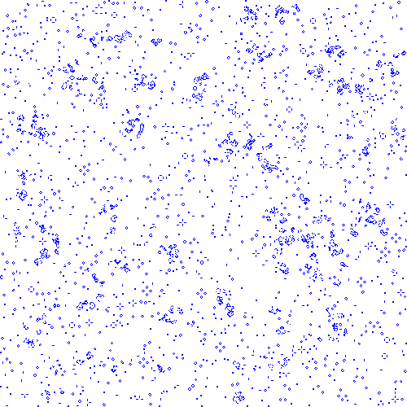
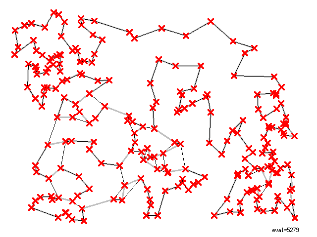
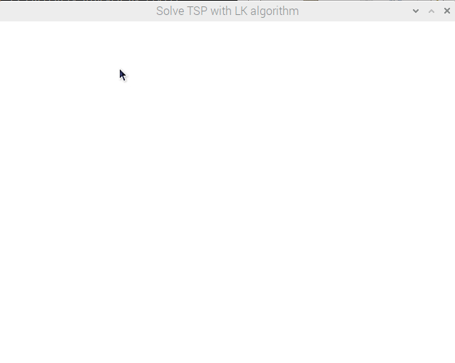
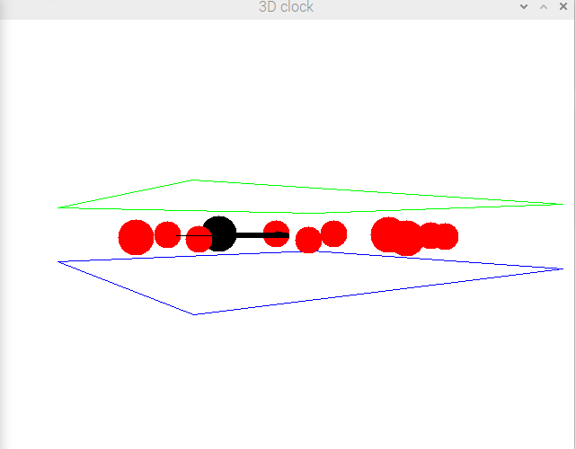
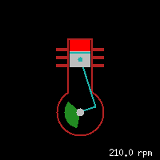
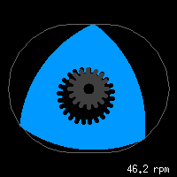

# ezxdisp
This repo is just last 2007 changed version of ezdisp (**yet another simple graphics library**) from here:  
[http://morihit.net/ezxdisp/](http://morihit.net/ezxdisp/)  

ezxdisp-0.1.4.tar.gz on that page does not match mentioned MD5 checksum: 15e96cebf9796c7dc1775c4b3324776f.  

I found file with correct MD5 checksum on hackaday.io. The file is used to build this repo, local copy:  
[origin/ezxdisp-0.1.4.tar.gz](origin/ezxdisp-0.1.4.tar.gz)

Building instructions, documentation, screenshots, ... on the website linked to above.

No updates for 15 years, but this library is still good for what it was built for.  
This repo should just make it easier to clone/fork.  
Only [ezxdisp-0.1.4/](ezxdisp-0.1.4/), [LICENSE](LICENSE), [origin/](origin/), [README.md](README.md) and (top level) [Makefile](Makefile) added to original.  
[This commit](https://github.com/Hermann-SW/ezxdisp/commit/19c1694abeecaec29724a4820b46772ff059639f) fixed some "unused variable" compiler warnings in 2007 codes.  

## support for C++ / use in IDE

On [forum request](https://forums.raspberrypi.com/viewtopic.php?p=2044260#p2045169) first this repo runs in Geany IDE. And g++ support was added as well (library build with gcc only). These are the installation instructions:  

    cd
    git clone https://github.com/Hermann-SW/ezxdisp.git
    cd ezxdisp
    make libezx.a
    sudo cp include/ezxdisp.h /usr/local/include
    sudo cp src/x11/libezx.a /usr/local/lib

In Geany, go to "Build->Set Build Commands" and set "2. Build" command to 

    gcc -Wall -o "%e" "%f" -lezx -lX11 -lm

for gcc or 

    g++ -Wall -o "%e" "%f" -lezx -lX11 -lm -Wno-write-strings

for g++. Open any file from "~/ezxdisp/samples/\*.c" in IDE, press F9 to build without warnings, and then F5 to run.

## Screenshots of Applications developed using ezxdisp

Just while we are here, below is copied in screenshot page from the website, with two animations added:  
[http://morihit.net/ezxdisp/screenshots.html](http://morihit.net/ezxdisp/screenshots.html)  

### Conway's Game of Life

<kbd></kbd>

### Solving a TSP Problem using the Lin-Kernighan Algorithm

<kbd></kbd>

<kbd><kbd>

### Finding a Steiner Tree

<kbd></kbd>

### 3D Clock

<kbd></kbd>  

<kbd><kbd>

### A Clone of the xengine

<kbd></kbd>

### Rotary Engine

<kbd></kbd>
